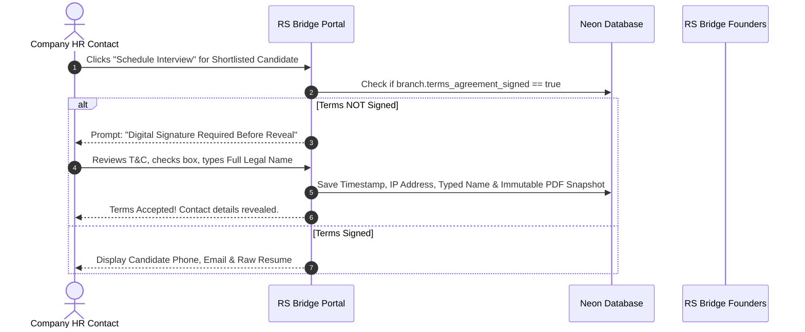

# RS Bridge Consultancy — Platform Design & Architecture Showcase
> **Prepared for:** RS Bridge Consultancy Founders & Leadership Team  
> **Purpose:** System Specification, Flow Validation, Security Architecture & Commercial Term Rules Sign-off

---

## 1. Executive Summary & Tech Stack ($0 Operating Cost Model)

This platform is engineered to transform RS Bridge Consultancy from a manual email/brochure operation into a high-performance recruitment management system. The stack is designed for **zero ongoing hosting costs**, built to scale smoothly as client volume grows.

| Layer | Selection | Advantage |
|---|---|---|
| **Web Framework** | Next.js 14+ (App Router, TypeScript) | Unified frontend & API server; $0 hosting on Vercel Hobby tier |
| **Database & ORM** | Neon Serverless Postgres + Prisma ORM | Enterprise relational DB with $0 free tier & instant branch backups |
| **Authentication** | NextAuth.js (Auth.js) | Self-hosted secure sessions, magic links, & role isolation |
| **File Storage** | Cloudflare R2 | 10 GB free resume & contract PDF storage with **$0 egress fees** |
| **Email & WhatsApp** | Resend + Meta Cloud API Direct | Transactional messaging with free monthly conversation tiers |

---

## 2. End-to-End Recruitment Workflow (Visual Flow)

```mermaid
flowchart TD
    subgraph Candidate Flow
        A1[Candidate visits /jobs] --> A2[Register / Login]
        A2 --> A3[Upload Resume & Profile]
        A3 --> A4[Apply to Job Requirement]
        A4 --> A5[Receive Status Updates via Email/App]
    end

    subgraph Internal Staff Flow (Employee / Admin)
        B1[New Application Auto-Assigned] --> B2[Screen & Review Resume]
        B2 --> B3[Move to Shortlisted Stage]
        B3 --> B4[Schedule Interview]
        B4 --> B5[Mark as Joined / Placed]
    end

    subgraph Company Client Flow (HR Contact)
        C1[Company Inquiry / Sign-up] --> C2[Admin Approves HR Account]
        C2 --> C3[Post Job Requirement]
        C3 --> C4[Sign Digital Terms of Business]
        C4 --> C5[Review Candidates & Attend Interviews]
    end

    A4 --> B1
    B4 --> C5
    B5 --> D[Auto-Generate Invoice Draft]
```

---

## 3. Anti-Disintermediation & Contact Masking Matrix

To protect RS Bridge Consultancy’s business model and ensure clients do not bypass the consultancy to hire candidates directly, **strict server-side security masking** is enforced:

| Pipeline Stage | Candidate Views | Company/HR Views | Platform Security Action |
|---|---|---|---|
| **Public / Browsing** | Company identity shown as *"Confidential Client"* | Masked Resume (Skills, Experience, Education only; **NO phone/email**) | System auto-generates branded PDF resume on-demand |
| **Applied & Screening** | Application Status: *"Under Review"* | Masked Resume only (**NO phone/email**) | Raw uploaded PDF file is locked on server |
| **Shortlisted** | Application Status: *"Shortlisted"* | Masked Resume only (**NO phone/email**) | Direct candidate contact info stripped by API |
| **Interview Scheduled** | Interview Details & Date | **REAL Contact Info Revealed** (Phone, Email, Raw Resume) | **GATE:** Requires `terms_agreement_signed = true` |
| **Joined / Placed** | Application Status: *"Joined"* | Full Candidate & Placement Record | Triggers Placement record & commission invoice draft |

> [!IMPORTANT]
> **Legal Security Gate:** A company branch **cannot access real candidate phone numbers or original resume files** at the interview stage until an authorized HR representative has digitally signed the **RS Bridge Terms of Business**.

---

## 4. Digital Terms of Business Workflow



---

## 5. Commercial Terms & Financial Logic

| Term Category | Standard Provision | Platform Enforcement Rules |
|---|---|---|
| **Commission Rate** | **8.33% to 25%** of Annual CTC | Snapshotted at Placement creation; protected from retroactive edits |
| **Payment Window** | **30 to 45 Days** from Candidate Joining Date | Invoice auto-calculates `due_date`; daily job flags overdue invoices |
| **Replacement Guarantee** | **60 to 90 Days** Free Replacement | Requires Admin verification of resignation proof document |
| **Free Replacement Hire** | **1 Free Swap Per Placement** | Replacement placements (`replaces_placement_id != null`) are **permanently excluded** from invoice queries |
| **Employee Financial Isolation** | Internal Staff Access | Employee role is **strictly blocked at API level** from viewing any financial/commission figures |

---

## 6. Role & Permission Matrix

| Feature / Action | Candidate | Company HR | Employee (Staff) | Admin (Founders) |
|---|:---:|:---:|:---:|:---:|
| Browse Public Job Listings | ✅ | ✅ | ✅ | ✅ |
| Submit Application / Resume | ✅ | ❌ | ❌ | ❌ |
| Post Job Requirement | ❌ | ✅ (Pending Approval) | ✅ | ✅ (Instant Open) |
| Review Candidate Shortlists | ❌ | ✅ (Masked / Unmasked) | ✅ (Unmasked) | ✅ (Unmasked) |
| Access Real Contact Info | ❌ | 🔒 (Requires Signed Terms) | ✅ | ✅ |
| Change Application Status | ❌ | ❌ | ✅ | ✅ |
| View Financials / Invoices | ❌ | ✅ (Own Invoices Only) | ❌ **(Blocked)** | ✅ (Full Access) |
| Approve HR Logins & Terms | ❌ | ❌ | ❌ | ✅ |
| Verify Resignation Proof | ❌ | ❌ (Upload Only) | ❌ | ✅ |

---

## 7. Data Intake Bridge (Google Forms to Web App)

During the app build phase, data is collected via **Google Forms**. All fields are mapped **1:1** to the database schema:

```
[Candidate Google Form]  --> [Google Sheet] --> [CSV Export] --> [Admin CSV Import Tool] --> [Neon Postgres Candidate DB]
[Company Google Form]    --> [Google Sheet] --> [CSV Export] --> [Admin CSV Import Tool] --> [Neon Postgres Company DB]
```

* **Candidate Dedup Key:** `mobile` number (updates existing record if submitted twice).
* **Company Dedup Key:** `company_name` + `city`.
* **Missing Optional Fields:** Automatically populated as `"NA"` for easy follow-up.
