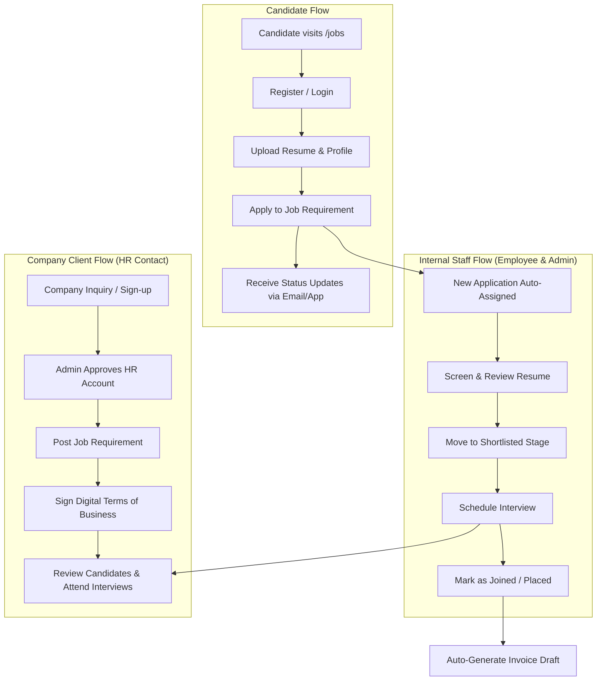
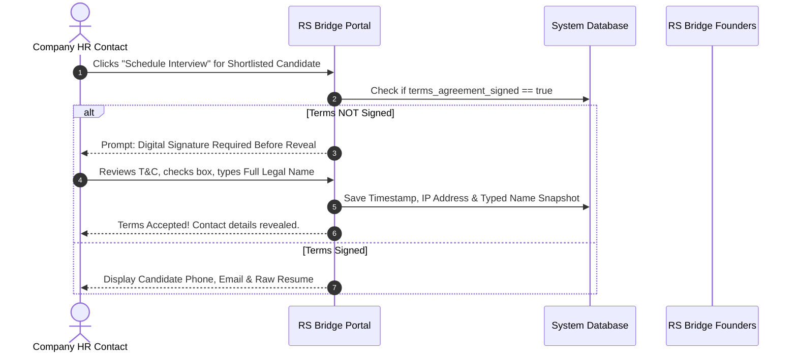

# RS Bridge Consultancy — Business Functionality & Feature Proposal
> **Prepared for:** RS Bridge Consultancy Founders & Management  
> **Purpose:** Overview of System Features, Business Workflows, Candidate Protection, and Commercial Rules

---

## 1. Executive Summary & Core Business Benefits

This system transforms RS Bridge Consultancy from manual email tracking into a modern, 24/7 recruitment platform. It is engineered specifically for your business model with **zero ongoing software subscription costs**.

### Key Advantages for Your Consultancy:
* 🔒 **Business Protection (Anti-Bypass):** Candidates and client companies cannot bypass RS Bridge to deal directly. Contact details are strictly hidden until legal terms are signed.
* ⚡ **Automated Pipeline:** New candidate applications are automatically assigned to your team members so no lead is missed.
* 📄 **Digital Terms of Business:** Clients digitally sign your commercial terms directly inside the system before receiving candidate contact details.
* 📊 **Financial Control for Founders:** Your team members manage the candidates and interviews, while **all financial figures, commission rates, and invoices remain strictly private to the 2 founders**.

---

## 2. End-to-End Recruitment Workflow (Visual Flow)

---

## 3. The 4 Portals (Who Gets Access & What They Can Do)

| User Portal | Who Uses It | What They Can See & Do |
|---|---|---|
| 💼 **Public & Candidate Portal** | Job Seekers | • Browse active open job listings across Delhi NCR • Create free account & upload multiple resume versions (IT CV, Sales CV, etc.) • Apply to jobs in 1 click & track application status • **100% Free** — candidate notice clearly displayed |
| 🏢 **Client Company Portal** | HR Managers & Hiring Directors | • Post open job vacancies for your approval • Review candidate shortlists with masked resumes (no direct contact info) • Review & digitally sign RS Bridge Terms of Business • View interview schedules & candidate contact details (post-signing) • Report candidate resignations for free replacement |
| 👥 **Internal Team Portal** | RS Bridge Employees / Staff | • Access full candidate database to search & add walk-in applicants • Drag-and-drop applications through pipeline stages (Screening → Shortlisted → Interview → Joined) • Schedule candidate interviews with clients • Log candidate joinings • 🚫 **Blocked from seeing commission rates & invoice amounts** |
| 👑 **Admin Portal** | 2 Founders / Owners | • Full oversight of all firm operations & client relationships • Approve new HR accounts & job posting requests • Review & set custom commission rates (8.33% to 25%) per job • View revenue, draft invoices, sent invoices, and overdue tracking • Verify candidate resignation documents to approve free replacement hires |

---

## 4. Step-by-Step Business Workflow

### **Step 1: Requirement Intake & Approval**
1. Client HR posts a job vacancy on the portal.
2. The requirement enters **Pending Approval** status.
3. Founders review the job description, set the commission rate (or use standard branch rate), and approve it to go **Live**.

### **Step 2: Candidate Application & Round-Robin Assignment**
1. Candidate finds the job on the public job board and applies with their resume.
2. The application is **automatically assigned** to an internal team member so work starts immediately.
3. Team member screens the candidate's skills and experience.

### **Step 3: Shortlisting & Masked Resume Sharing**
1. Team member moves candidate to **Shortlisted**.
2. Client HR receives a notification and views a **Branded RS Bridge Resume** (showing qualification, skills, and work history, but **NO phone number or email**).

### **Step 4: Digital Terms Signing & Interview Scheduling**
1. Client HR wants to interview the shortlisted candidate.
2. **Security Gate:** If the client has not yet signed the RS Bridge Terms of Business, the portal prompts them to sign digitally (checking agreement box + typing full legal name).
3. Once signed, candidate contact details are unlocked, and the interview date is set.

### **Step 5: Joining & Auto-Invoicing**
1. Candidate successfully clears interviews and joins the company.
2. Application status is updated to **Joined**.
3. System automatically generates a **Draft Invoice** for the founders to review and send to the client (payable in 30–45 days).

---

## 5. How Candidate Privacy & Firm Commission Are Protected

| Feature | How It Works | Why It Protects Your Business |
|---|---|---|
| **Masked Pre-Interview Resumes** | Before interview stage, company sees experience & skills only; contact details are removed. | Prevents companies from calling candidates directly and bypassing RS Bridge commission. |
| **Digital Terms Gate** | Candidate contact info is revealed ONLY after HR accepts RS Bridge Terms of Business. | Legally binds the client to pay commission on any hire made from your introduced pool. |
| **Confidential Client Listings** | Job postings on the public site display company name as *"Confidential Client"*. | Prevents candidates from applying directly on the company's career portal. |
| **Employee Financial Masking** | Internal recruiters see operational status but CANNOT view commission % or invoice totals. | Keeps financial revenue & margin figures exclusive to the 2 founders. |

---

## 6. Commercial Terms & Guarantee Rules

| Business Rule | Standard Policy | Platform Enforcement |
|---|---|---|
| **Commission Rates** | 8.33% to 25% of Annual CTC | Automatically saved at placement time; cannot be altered retroactively. |
| **Payment Terms** | 30 to 45 Days after joining | System tracks invoice due dates and alerts founders daily if an invoice becomes overdue. |
| **Free Replacement Window** | 60 to 90 Days replacement guarantee | Client uploads resignation proof document → Founders verify → Requirement re-opens for replacement hire. |
| **Replacement Invoicing** | 1 Free Replacement per placement | Placement rows marked as replacement hires are **automatically excluded from invoicing** so client is never double-billed. |

---

## 7. Smooth Transition from Google Forms to the App

While the application is being finalized:
1. You can collect data right now using **Candidate & Company Google Forms**.
2. The forms collect data formatted **1:1 with the application's database**.
3. When the app launches, all stored candidates and companies will be **bulk-imported in seconds** with zero data loss!
